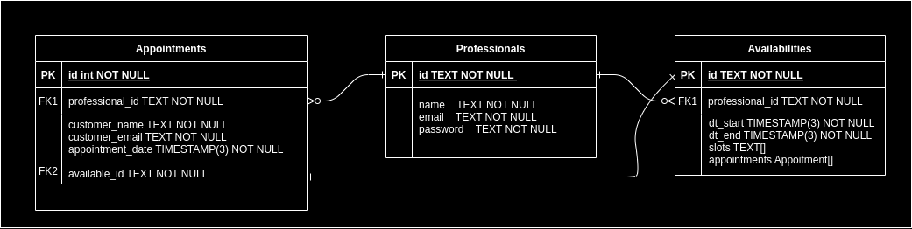

##

###

<div>
    <h1 align="center">Zenklub Schedule API</h1>
    
</div>
<div style="display: flex; align-items: center; justify-content: space-between; padding: 50px">
  <div> 
    <p style="width: 90%">Desenvolvimento de uma API para gerenciamento de disponibilidade de profissionais com uso de slots de tempo e marcação de consultas.</p>
    <p>Status: Finalizada ✅</p>
  </div>
  <div>
    
  </div>
</div>

### Features

- CRUD de gerenciamento para profissionais;
- Listagem de disponibilidade;
- Reserva de sessões;
- Autenticação de profissionais;
- Disparo de e-mails de confirmação de consulta ao cliente;
- Desistência de consulta;

<br/>

### Modelagem DER



### Documentação

⚠️ A aplicação deve ser inicializada para que seja possível acessar a documentação.

- [Swagger](http://localhost:3000/api-docs)

### Tecnologias

As seguintes ferramentas foram usadas na construção do projeto:

- [Node.js](https://nodejs.org/en/)
- [Express](https://expressjs.com/pt-br/)
- [PostgreSQL](https://www.postgresql.org)
- [Prisma](https://www.postgresql.org)
- [Docker](https://www.docker.com)
- [Mailtrap](https://mailtrap.io)

### Pré-requisitos

- [Git](https://git-scm.com)
- [Node.js](https://nodejs.org/en/)
- [Docker](https://www.docker.com)
- [VSCode](https://code.visualstudio.com/)

<br>

<div >

### Funcionamento da API

```bash
# Acesse o projeto no terminal/cmd
$ cd zenklub-test
# Instale as dependências
$ npm install
# Execute a aplicação
$ docker-compose up
```

</div>

</br>
<hr/>
</br>

<p align="center">
Feito com 💜 por Inaê Rosa
</p>
